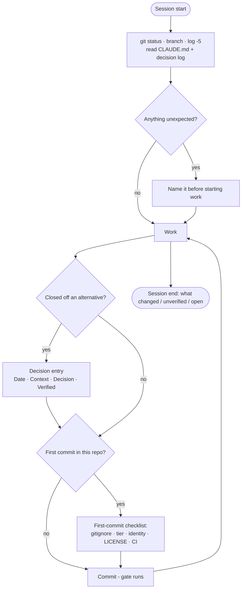

# CLAUDE.md

Guidance for AI coding assistants (Claude Code, Codex) working in this workspace. `AGENTS.md` is a
symlink to this file.

## Overview

A personal development workspace: many independent projects under `projects/`, a template system
under `templates/`, and `dotfiles/` — the public repo holding the security gate, the audit tooling
and the policy docs, with its private companion repo cloned at `dotfiles/private/`. `~/dev` itself
is not a git repo.

## Hard rules

- **Every commit and push passes the security gate** (`dotfiles/security/gate.sh`). Never bypass
  it: never use `--no-verify` or `-n`, never touch `core.hooksPath` or `hook.*` config, never ask the
  user to set `SECURITY_GATE_BYPASS`. Fix the finding, or stop and report it.
- **Committer identity is the GitHub noreply address.** Never set a personal email in any repo.
- **Public repo ⇒ LICENSE in the first commit.** Canonical line `Copyright (c) <year> Pieter de Jong`;
  the manifest's `license` field must match.
- **Never relicense or reshape a fork or upstream clone**, and skip them in bulk sweeps.
- **No media or large binaries in git** (video, audio, weights, big datasets) — not even private.
- **Exact version pins** — no `^` or `~`.
- **Never write audit output inside a git repo.** Reports go to `~/dev/audit-reports/`, mode 600.
- **Every repo's CI includes gitleaks** via the reusable workflow — added when a repo is created or
  next touched; never to do-not-touch repos, forks or upstream clones.
- **Confirm before outward-facing actions:** push, visibility or settings changes, deletes, anything
  published. Never open or print credential files.
- **A "done" needs its verification command and output**, not a statement.

## Do-not-touch

@dotfiles/private/registers/do-not-touch.md

If that file is missing, ask before modifying any repo under projects/.

## Session workflow

Every session runs the same loop. Steps 2 and 3 are stated in full elsewhere — what follows is the
order they happen in, not a second copy of them.

1. **Open by reading state, not code.** `git status`, the branch, `git log --oneline -5`, then the
   project's `CLAUDE.md` and decision log if they exist. Name anything unexpected — dirty tree,
   detached HEAD, unpushed commits, a stray untracked file — before touching anything. A surprise
   is cheapest before it has been built on. The `SessionStart` hook reports this automatically and
   says nothing when the repo is clean; silence is the normal case, not a failure to run.
2. **First commit in a repo** follows `dotfiles/docs/policy/security-and-privacy.md` §4 —
   `.gitignore` baseline, data tier, noreply identity, LICENSE, gitleaks job.
3. **A decision that closes off an alternative earns an entry**, in the format and with the
   `Verified:` discipline of `dotfiles/docs/policy/ai-instructions.md` § Decisions need
   verification. Not every commit — only a choice someone could reasonably reopen later.
4. **Close with a summary:** what changed, what is unverified, what is still open. Update the
   project's README or `CLAUDE.md` in the same session when commands or behavior changed; a doc
   that lags by one session is where drift starts. Say any `Verified: NOT YET` out loud rather
   than leaving it to be discovered.



## Where the rules live

Read these when their subject comes up; they are not loaded automatically.

| Doc | Covers |
|---|---|
| `dotfiles/docs/policy/security-and-privacy.md` | Data tiers, the gate, bypass, first-commit and go-public checklists, leaks, CI scanning, GitHub baseline, guardrails |
| `dotfiles/docs/policy/repo-standards.md` | Licensing, GitHub tiers, `.gitignore` baseline, `init.sh`/`run.sh`, dependencies, media, lint |
| `dotfiles/docs/policy/ai-instructions.md` | Instruction-file layering, `CLAUDE.md` vs memory, decision records |
| `dotfiles/docs/policy/backups.md` | Backup principles |
| `dotfiles/docs/design-decisions.md` | Why the gate, audit and public/private split are built this way |
| `dotfiles/docs/maintenance.md` | The weekly security audit and what to do with its findings |
| `dotfiles/docs/containers.md` | Colima on demand (no Docker Desktop), local vs hosted Supabase, native Postgres, what needs Docker |
| `dotfiles/docs/dev-audit.md` | `dotaudit`: read-only audit of every local repo |
| `dotfiles/private/registers/` | Private: open findings, per-repo privacy, licensing, GitHub baseline, backup state |
| `dotfiles/private/reports/` | Private: dated audit reports (point-in-time, not maintained) |

Before claiming any sweep covered "all repos", check the GitHub baseline register — not every
GitHub repo is cloned here.

Workspace notes that stay at the root: `TODO.md` (open work), `IDEAS.md` (retired project sketches —
check before starting something that sounds familiar), `PROJECT_OVERVIEW.md` (deep-dives on specific
projects).

## Templates (`templates/`)

Five curated stacks. Three have `minimal-mvp` and `production-ready` variants; `rn-supabase` and
`vercel-stack` are single production-oriented layouts (`templates/DEPENDENCY_MATRIX.md`).

| Stack | Dir | Variants | Description |
|---|---|---|---|
| Python FastAPI | `templates/py-fastapi/` | minimal-mvp, production-ready | REST API, Pydantic; optional PostgreSQL/Redis/JWT |
| TypeScript React | `templates/ts-web/` | minimal-mvp, production-ready | Vite + React; optional Tailwind/React Query/Vitest |
| Node.js Express | `templates/node-express/` | minimal-mvp, production-ready | Express + TypeScript; optional PostgreSQL/Docker |
| React Native + Supabase | `templates/rn-supabase/` | single | Expo + Supabase auth and database |
| Next.js on Vercel | `templates/vercel-stack/` | single | Next.js App Router + Supabase auth/Postgres |

```bash
cd templates/<stack>/<variant>   # or templates/rn-supabase
./init.sh        # venv or node_modules; .env from template
./run.sh         # dev server (default)
./run.sh build   # production build
./run.sh test    # tests (production-ready variants)
./run.sh lint    # linters
./run.sh format  # auto-format
```

Production-ready variants add `./run.sh prod`, `./run.sh debug`, `./run.sh type-check`.

Dev servers: py-fastapi `http://localhost:8000` (docs at `/docs`) · ts-web `http://localhost:5173` ·
node-express `http://localhost:3000` · vercel-stack `http://localhost:3000` (don't run with
node-express) · rn-supabase: Expo QR code, `w` for web.

- **py-fastapi/production-ready** needs a running Docker daemon — `colima start` first (PostgreSQL + Redis); `./run.sh` runs `alembic upgrade head`.
- **rn-supabase/production-ready** needs the Supabase CLI and a running Docker daemon (`colima start`); `./run.sh` starts local Supabase at `http://localhost:54321`.
- Every template ships `.github/workflows/ci.yml`; it runs once the new project is pushed.
- Scaffold by copying the directory; don't change dependency versions until `./init.sh` succeeds.
- **`node-express/production-ready` is red** (lint, format, type-check and tests fail; it cannot
  start). Don't scaffold from it until repaired.
- **Not templates:** `general/`, `py-django/`, `py-flask/`, `py-fullstack/`, `ts-server/`,
  `rn-supabase-legacy/` and the `base-app` / `base-api` / `framework-base` subdirs are separate
  repos with their own remotes, several with uncommitted work. Don't scaffold from them and don't
  include them in sweeps over `templates/`. Per-directory state: `templates/INVENTORY.md`.
  `templates/` itself is not a git repo.

## Per-project CLAUDE.md

Most projects don't need one. Create it when a project is a git repo with real build/test/lint
tooling, or once you are doing substantive work in it — never batch-generated. Shape: Overview ·
Commands (exact) · Architecture (only the non-obvious) · Gotchas. Details:
`dotfiles/docs/policy/ai-instructions.md`.
