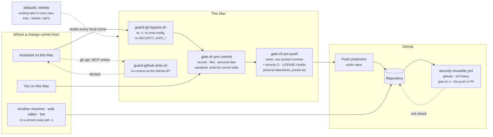

# Repo standards

What every repo on the account carries, and how projects in the workspace are shaped.
Security rules are in [security & privacy](security-and-privacy.md); per-repo state is in the
private companion repo (`../../private/registers/licensing.md`,
`../../private/registers/github-baseline.md`), not published.

---

## Licensing

Pick the license when the repo is created. A public repo with no LICENSE is "all rights
reserved": nobody may legally use, copy or contribute to it — almost never the intent.

| What the repo contains | License |
|---|---|
| Code (the default) | MIT |
| Data, datasets, editorial or written content | CC0-1.0, or CC-BY-4.0 when attribution matters |
| Code and content together | Split LICENSE: MIT for the code, the content reserved or CC |
| Private or commercial work | All Rights Reserved |
| A fork or upstream clone | Upstream's license, exactly as-is |

- **Public ⇒ LICENSE file in the first commit.** Private repos don't need one; MIT anyway is
  harmless and saves a scramble if the repo ever flips public.
- **Canonical copyright line: `Copyright (c) <year> Pieter de Jong`** — no other spelling of the
  name. `<year>` is the year of the first commit, not the year the file was added.
- **The manifest matches the LICENSE.** `npm init -y` writes `"license": "ISC"` — set `"MIT"`. Add
  `license` to `pyproject.toml`. Always fix the manifest to match the file, never the reverse:
  the file is what people read and GitHub reports.
- **Never relicense a fork or an upstream clone**, and skip them in every bulk sweep. Upstream
  choosing no license means there are no rights for you to grant; rewriting someone else's
  copyright line is the licensing mistake that's hard to undo.
- **Third-party material keeps its own terms.** Vendored files ship their license text. A
  take-home assignment's prompt and starter code belong to the issuer — MIT on your solution
  doesn't cover them; leave such repos unlicensed unless the two are separated.
- **A LICENSE file is not a license.** Check it parses: names a license or asserts rights, and is
  more than a line. (Captured terminal output once passed a file-exists check for months.)
- **CC licenses use the verbatim legal text.** A prepended header breaks GitHub's detection;
  attribution goes in the README.
- **Define a split license by exclusion** ("everything except …") so a new directory can't
  silently fall outside the grant. GitHub reports it as "other"; that's correct.
- **Templates ship a LICENSE with `<YEAR>` and `<HOLDER>` placeholders** that `init.sh` fills in.

## GitHub standard — tiers

Forks and archived repos are excluded.

### Tier A — every repo, including dormant ones

| # | Rule | Why |
|---|---|---|
| A1 | `README.md` says what the repo is in its first paragraph | An unidentifiable repo is a liability at cleanup time |
| A2 | GitHub description is set | The only thing visible on the profile listing |
| A3 | Public ⇒ LICENSE ([licensing](#licensing)) | No LICENSE = all rights reserved |
| A4 | `.gitignore` with the [baseline](#gitignore-baseline) | Secrets and cruft stay out |
| A5 | Dormant repos are **archived** | Separates "unmaintained by choice" from "abandoned" |
| A6 | Security CI (`security-reusable.yml`) and the GitHub baseline settings ([security](security-and-privacy.md#9-secret-scanning-in-ci--the-standard-for-every-repo)) | Server-side backstop to the local gate |

Decide the archive question before a LICENSE sweep, so dormant repos aren't licensed and then archived.

### Tier B — additionally, any repo pushed within ~12 months

| # | Rule | Why |
|---|---|---|
| B1 | `.github/workflows/ci.yml` on push and PR to the **default branch** | The core CI ask |
| B2 | CI runs lint + type-check + test for the language | A checkout-only workflow is theatre |
| B3 | CI is green, or its failure is recorded with an owner | A permanently red badge trains you to ignore it |
| B4 | Default branch is `main` | A `main`/`master` split silently breaks copied workflow triggers |
| B5 | Actions pinned to a full commit SHA, current major in a `# vX.Y.Z` comment ([supply chain](supply-chain.md)) | A tag can be moved to new code after review; old majors stop working |
| B6 | Deploy target declared: Pages workflow, hosting project, or "none" | Otherwise deploys are tribal knowledge |

### Tier C — additionally, public repos adjacent to private data

The [five-layer guard](security-and-privacy.md#12-five-layer-guard-for-paths-that-must-never-be-committed).

## Project hygiene

### `.gitignore` baseline

Every project has one **before the first commit**, covering at minimum:

- `.env` and `.env.*`, with `!.env.example` if one exists
- Build and cache dirs: `__pycache__/`, `.venv/`, `venv/`, `node_modules/` (and `**/node_modules/`),
  `.mypy_cache/`, `.ruff_cache/`, `.pytest_cache/`, build output
- OS and editor cruft: `.DS_Store`, `.vscode/`, `.idea/`
- Logs, and any project-specific data or output directory holding generated or personal data

Verify it with `git check-ignore`, not by reading it ([`.gitignore` facts](security-and-privacy.md#7-gitignore-facts)).
Never add rules to a fork's `.gitignore`; keep it identical to upstream.

### Scripts: `init.sh` and `run.sh`

Every project exposes the same entry points, whatever the stack. **If it isn't in a script, it
doesn't exist** — a README step a human translates into commands is done differently each time.

```bash
./init.sh        # everything needed to work on it; exit 0 = ready; idempotent
./run.sh         # the default thing (dev server)
./run.sh build   # production build
./run.sh test    # tests; exit 0 = safe to deploy
./run.sh lint    # linters
./run.sh format  # auto-format
```

Production-shaped projects add `prod`, `debug`, `type-check`.

- **Exit codes are the interface.** `set -euo pipefail`; be deliberate where it's turned off.
- **`init.sh` is idempotent** — a second run neither fails nor rebuilds from scratch. It creates
  `.env` from `.env.template` and recreates dependency dirs, so those are always disposable.
- **No absolute paths** — use `$HOME` or paths relative to the script.
- **Back up before anything destructive**, and log what happened.
- **Prefer conventions that fail loudly.** A broken script fails today; a wrong architecture doc
  fails silently, years later.

### Self-contained projects

- Prefer the stdlib or one small library over a framework or SDK for a script or small tool.
- Prefer a dependency already used elsewhere in the workspace over a second that does the same job.
- Vendoring small single files (KBs to low MBs) to avoid a runtime network dependency is fine;
  vendoring SDKs, browser binaries, model weights or datasets "just in case" is not.
- Fetch large things on demand from the project's init step into a gitignored cache directory.
- **Never download or commit multi-hundred-MB or GB-scale files** (weights, datasets, video,
  database dumps, container images) without stating size and source and getting confirmation.
- Retiring a project: save the idea in a keepsake note before deleting the code.

### Per-project `CLAUDE.md` shape

When a project warrants one ([when](ai-instructions.md#per-project-files-are-lazy)):

- **Overview** — what the project is, one paragraph.
- **Commands** — exact install, run, test, lint, build commands. Not prose.
- **Architecture** — only what a newcomer would otherwise read the whole tree to learn.
- **Gotchas** — sharp edges not discoverable from the code.

## Dependencies

- **Pin exactly — no `^`, no `~`.** A range makes behaviour depend on install day; a pin keeps a
  project untouched for two years installable. This covers `package.json` (not
  `peerDependencies`, which declare compatibility), `requirements*.txt` and `pyproject.toml`
  (`==`; poetry's `python` constraint and `[build-system]` are exempt). There are no published
  libraries here; if one appears, its range-pinned metadata is a decision entry, not a quiet
  exception.
- **Record proven combinations** in a dependency matrix, each with the date verified and the reason
  for any unusual pin. An undated matrix is a wish list; if it has drifted, say so at its top.
- **One package manager per project.** `npm` by default; `pnpm` or `yarn` only if already in use.
- **Scaffolding from a template:** copy it, run `./init.sh` successfully, and only then change versions.
- **Pinning freezes vulnerabilities too.** Dependabot alerts come from the
  [GitHub baseline](security-and-privacy.md#10-github-baseline-settings); upgrade deliberately in response.

## Media and large binaries

Video, audio, model weights and multi-hundred-MB datasets are **never committed, even to a private
repo.** GitHub rejects files over 100 MB, the gate blocks any file over 50 MB, any video, audio or
weights file at any size, and any image over 5 MB (`MEDIA_EXT_ERE` and `IMAGE_MAX_BYTES` in
`security/patterns.sh`). History never shrinks.

1. `.gitignore` the extensions.
2. Keep `<project>/assets/README.md` listing each asset's name, size, sha256, and where the
   canonical copy lives.
3. Serve media from a host built for it (object storage, a CDN, an unlisted video host), not the repo.

Git LFS is a fallback, not the default: it moves the bytes, not the cost. Gitignored media is **not
backed up by git** — give it an explicit backup ([backups](backups.md)).

## Lint and format conventions

| Stack | Lint | Format | Types | Tests |
|---|---|---|---|---|
| Python | `ruff check` | `black` (+ `ruff --fix`) | `mypy` | `pytest` |
| TypeScript / JS | ESLint | Prettier | `tsc --noEmit` | Vitest or Jest |

- Wire each through `./run.sh lint | format | type-check | test`; CI runs the same commands.
- Pin formatter versions in the manifest; a new major can reformat files the local version accepts.
- Strict types where the language allows, including Python annotations.

## Enforcement

A rule is in force when it has a row here. Each row names where the rule is written and what checks
it, so "is this enforced?" has one answer. `scripts/test-docs.py` fails when a check id the policy
module (`scripts/audit/20-policy.sh`) can emit is missing from this table, or when the workspace
`CLAUDE.md` stops pointing here.

- **Gate** (`security/gate.sh`) blocks what a commit or push *introduces*. An old repo's existing
  debt never blocks an unrelated commit.
- **CI** (`security-reusable.yml`) runs the same gate (`gate.sh ci`) on GitHub over every push and
  PR, so commits that skipped this machine's hooks are held to the same rules.
- **dotaudit** (`scripts/audit/`, weekly) reports what is *already there*, across every repo.
- **Standards** bind repos owned by `pieteradejong` (or with no GitHub remote yet). Forks and clones
  of someone else's code get the secret and privacy rules only.

Every path by which content reaches GitHub, and what stands in each one:



The solid path is the one prevented. The dashed CI hop only detects, because GitHub can't require
the check before merge on this plan (findings EN-3). dotaudit reports what was there before any of
this existed.

| Rule | Written in | Gate (commit / push) | CI | dotaudit check id |
|---|---|---|---|---|
| No secrets | [security §2](security-and-privacy.md#2-the-commitpush-gate) | `gitleaks` block / block | gitleaks full history + gate | `gitleaks`, `secret-assignment`, `history-*` |
| No `.env`, key or credential files | [security §2](security-and-privacy.md#2-the-commitpush-gate) | block / block | gate | `env-file`, `private-key`, `ssh-key`, … (rule names in `patterns.sh`) |
| No personal data on GitHub, private repos included | [security §2](security-and-privacy.md#2-the-commitpush-gate) | warn (block if public) / **block** | gate | `home-path`, `email`, `ssh-config` |
| Committer identity is the noreply address | [security §6](security-and-privacy.md#6-committer-identity) | warn / **block** | gate | `committer-email` |
| No file over 50 MB | [media](#media-and-large-binaries) | block / block | gate | `large-files` |
| No media or weights, no image over 5 MB | [media](#media-and-large-binaries) | `media-file` block / block | gate | `tracked-media` |
| Exact version pins | [dependencies](#dependencies) | `unpinned-dependency` block / block | gate | `unpinned-deps`, `unpinned-deps-skipped` |
| One package manager per project | [dependencies](#dependencies) | `multiple-lockfiles` block / block | gate | `multiple-lockfiles` |
| Actions pinned by commit SHA | [tier B5](#tier-b--additionally-any-repo-pushed-within-12-months) | `unpinned-action` block / block | gate | `unpinned-action` |
| Security CI in every repo | [security §9](security-and-privacy.md#9-secret-scanning-in-ci--the-standard-for-every-repo) | — / `no-security-ci` block | — | `no-security-ci` |
| Public ⇒ LICENSE naming the canonical holder | [licensing](#licensing) | — / `no-license`, `license-holder` block | gate | `no-license`, `license-malformed`, `copyright-drift`, `license-mismatch` |
| `.gitignore` baseline | [baseline](#gitignore-baseline) | — | — | `no-gitignore`, `gitignore-env`, `gitignore-gaps` |
| `private/` never in public dotfiles | [security §2](security-and-privacy.md#2-the-commitpush-gate) | block / block | `private-guard` job | — |
| Never bypass the gate | [security §3](security-and-privacy.md#3-bypass-procedure) | the assistant: `guard-git-bypass.sh`; people: the bypass log | gate (no bypass) | `gate-bypassed`, `gate-disabled`, `gate-not-registered` |
| Content reaches GitHub only through git | [security §14](security-and-privacy.md#14-assistant-guardrails) | the assistant: `guard-github-write.sh` | — | — |
| GitHub push protection and secret scanning on | [security §10](security-and-privacy.md#10-github-baseline-settings) | — | — | `github-security-sweep.sh --check` |
| Audit output never inside a git repo | [security §13](security-and-privacy.md#13-audit-tool-design-rules) | assistant only | — | — |
| Confirm before outward-facing actions | [AI and external services](ai-and-external-services.md) | assistant only | — | — |
| Never relicense or reshape a fork | [licensing](#licensing) | standards skip forks | — | forks skipped |
| README, description, archive, default branch, deploy target (A1, A2, A5, B4, B6) | [tiers](#github-standard--tiers) | — | — | not checked: `private/registers/github-baseline.md` by hand |

---

## Appendix — shell pitfalls that shipped

Each one produced a wrong result silently.

| Pitfall | Fix |
|---|---|
| `set -e` is suppressed inside a function called in `&&`, `\|\|` or a condition | Check important commands explicitly; `return 0` where a last command may fail |
| `((count++))` returns non-zero when the old value is 0 — exits under `set -e` | `count=$((count + 1))` |
| `git diff --quiet` exits 1 when there *are* changes | Use it only as a condition: `if ! git diff --quiet; then` |
| `grep -c` prints `0` **and** exits 1, so `\|\| echo 0` yields two lines | `n=$(grep -c … \|\| true)` |
| Argument parsing after work has started | Parse `$@` first in `main()` |
| `done < <(cmd)` per item across hundreds of repos leaks processes until forks fail — later commands return empty | Build the list once into a temp file; read with plain redirects |
| A per-item subprocess (`git ls-files --error-unmatch` per path) | One set operation: `comm -23` on two sorted lists |
| A pipe into a `while` loop runs it in a subshell; counters are lost | `done < <(…)` or a temp file |
| A module-level global overwritten when every module is sourced before any runs | `local` inside the function |
| `find -maxdepth` too shallow — the report looks complete | Treat depth as a correctness bound; verify the count independently |
| Scanner writes to a path it refuses (`--report-path /dev/stdout`) → no output looks clean | Assert a known-bad fixture is detected and stderr is empty |
| Hardcoded `/Users/<name>/…` | `"$HOME"` or `$(dirname "${BASH_SOURCE[0]}")` |
| macOS `/bin/bash` is 3.2: no associative arrays, `mapfile`, `${var,,}`; BSD tools lack `xargs -r`, `grep -P`, `sed -r`, `find -printf` | Write to 3.2; test on macOS and Linux |
| An edit made to the repo copy in a copy-based sync, plus a doc saying it's done — next sync reverts the edit, not the doc | Edit the live source; verify the change, not the note about it |
| A zero count ("no findings") from a sweep | Confirm against an independent count before believing it |
