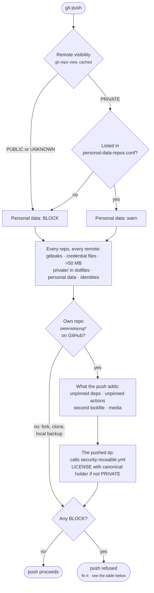

# Security & privacy policy

The rules every repo on this machine follows. Why they are built this way:
[design decisions](../design-decisions.md). The weekly run that checks them:
[maintenance](../maintenance.md). Licensing, hygiene and dependencies:
[repo standards](repo-standards.md). Assistant setup: [AI instructions](ai-instructions.md).

This doc governs **what gets committed and published**. What the code does, what data it handles,
what it depends on and where data flows through assistants have their own docs:
[secure development](secure-development.md) · [privacy by design](privacy-by-design.md) ·
[supply chain](supply-chain.md) · [AI and external services](ai-and-external-services.md).

**Anything pushed to a public repo is permanent and world-readable.** Deleting it, rewriting
history or making the repo private does not retract what was already cloned, cached or
scraped. Every rule below follows from that.

---

## 1. Principles and data tiers

- **Three problems, three tools.** Secrets (credentials) → gitleaks and rotation. Personal
  data (home paths, emails, phone numbers, hostnames, account names) → the gate, strict on the
  way to public. Private data sets (notes, exports, contacts, archives) → a data tier, below.
  A path guard cannot see a key pasted into a README; a secret scanner cannot tell a CSV of
  personal records from a public dataset.
- **Treat client/work code and a personal project going public the same way.** When unsure
  whether something is sensitive, take the stricter reading.
- **New repos start private.** Private → public is one command; public → private retracts nothing.
- **A cloned third-party repo brings its committed secrets with it.** They are not yours to fix:
  disclose to the owner; never rotate, rewrite or push from here. Don't keep such clones longer
  than the engagement.

### Pick a data tier at repo creation, not later

| Tier | Where the private data lives | Guard | Use when |
|---|---|---|---|
| **A** (default) | Outside the tree: a sibling private repo, an external directory or object storage; the app takes a path or env var | None — nothing to leak | Genuinely sensitive data |
| **A, nested** | A separate private repo checked out *inside* the public one, its path in `.gitignore` | `.gitignore` entry | Adjacent working notes |
| **B** | Inside the tree, gitignored | [Five-layer guard](#12-five-layer-guard-for-paths-that-must-never-be-committed) | The app truly needs a fixed in-repo path |
| **C** | Synthetic fixtures committed; real data local only | Light | Tests need shape, not substance |

- **Prefer Tier A.** Tier B's protection is a stack that must keep working on every clone,
  forever. Tier A's protection is distance.
- **Nested private repo:** git never descends into a directory containing `.git`, so even
  `git add -f` stages a gitlink, never content. Costs: `git clean -ffd` in the outer repo deletes
  the inner one (keep it pushed), and `grep -r`, editor search and AI assistants still read it —
  a repo boundary stops git, not readers.
- **Never split via a private submodule inside a public repo.** The submodule URL publishes the
  private repo's name and path, and public clones break on it.
- **Derived artifacts are data:** `.db`, caches, embeddings, indexes, exports. Ignoring `raw/` but
  not `*.db` protects the input and publishes the output.
- **Tests skip, not fail, when real data is absent** — and still fail when data is present but
  discovery is broken.
- **Document the public half.** The README states what data the app expects, its shape, where
  to get it and how to point the app at it; ship a small synthetic fixture.

## 2. The commit/push gate

`security/gate.sh` runs on every commit and every push in every repo on this machine. It is
registered in `~/.gitconfig` as config-based hooks (git ≥ 2.54):

```ini
[hook "security-gate-commit"]
    event = pre-commit
    command = ~/dev/dotfiles/security/gate.sh pre-commit
[hook "security-gate-push"]
    event = pre-push
    command = ~/dev/dotfiles/security/gate.sh pre-push
```

It runs **before** the repo's own hook, which still runs: `.git/hooks`, a repo-local
`core.hooksPath`, husky and the pre-commit framework all keep working. Nothing is written into
any repo. The rules live in `security/patterns.sh`, shared with `dotaudit`; gitleaks gets
`security/gitleaks.toml` passed explicitly, so a repo's own `.gitleaks.toml` cannot weaken it.

| Rule | commit | push → private remote | push → public or unknown remote |
|---|---|---|---|
| gitleaks secret | block | block | block |
| `.env` / key / credential files (`.example`, `.template`, `.sample` allowed) | block | block | block |
| File > 50 MB | block | block | block |
| `private/` in the dotfiles repo | block | block | block |
| gitleaks not installed | block | block | block |
| Home paths, real emails, phone numbers, private personal values | warn (block if origin is public) | **block** (warn in a listed personal-data repo) | block |
| Non-noreply author/committer email | warn | **block** (warn in a listed personal-data repo) | block |
| Repo standards, own repos only: pins, actions, lockfiles, media ([enforcement](repo-standards.md#enforcement)) | block what the commit adds | block what the push adds | block what the push adds |
| Security CI present (`no-security-ci`), own GitHub repos | — | block | block |
| LICENSE naming the canonical holder, own GitHub repos | — | — | block |

How one push is judged:



- **Nothing reaches GitHub without the full check, private repos included.** Private GitHub is
  still a third party, and one visibility flip from public. The only exception is a private repo
  that exists to hold personal data (the private companion repo), listed by `owner/repo` in
  `private/security/personal-data-repos.conf`. The list is central and private, so a repo cannot
  exempt itself, and a listed repo that turns public blocks again.
- **Commits that never passed this machine are checked on GitHub.** The same gate runs as
  `gate.sh ci` in the reusable security workflow (§9) over every push and PR. That covers
  `--no-verify`, another machine, the web editor and bots. Content written through the GitHub API
  skips git entirely, so the assistant is denied it (§14).
- **Visibility** comes from `gh repo view`, cached (public 24 h, private 1 h). A failed lookup or
  a non-GitHub remote is treated as **public**. A push to a non-GitHub remote (a local backup) is
  held to the secret and privacy rules only, since it publishes nothing.
- **Exemptions:** test, fixture and example paths, and lines containing `security-gate:allow`,
  are exempt from the personal-data rules only — never from the secret rules.
- **Push scans only commits not already on that remote**, so a commit made with `-n` is still
  caught when it is pushed.
- **It never prints a matched value** — only the rule and the file.
- `gate.sh status` checks the installation. `gate.sh scan-tree` checks what `git add -A` would
  commit right now.
- **Use Homebrew git.** Apple's `/usr/bin/git` ignores config hooks: keep Homebrew git first on
  `PATH`, and set `git.path` in editors.

### When the gate blocks: what each finding means

Every block names a rule id. Fix the cause; the [bypass](#3-bypass-procedure) is for a genuine
false positive only. After a fix, `git add` again and retry. For a finding in a commit already made,
`git commit --amend` or `git reset HEAD~1`, then commit again.

| Rule id | Means | Fix |
|---|---|---|
| `gitleaks` | A secret is in the change | **Rotate it first** (§8), then remove it and read it from the environment. Deleting it later doesn't unpublish it. |
| `gitleaks-missing`, `gitleaks-error` | Nothing could be scanned | `brew install gitleaks`; rerun. The gate fails closed. |
| `env-file`, `private-key`, `ssh-key`, `netrc`, `package-auth`, … | A credential-shaped file is staged | `git restore --staged <file>`; add it to `.gitignore`; commit a `.example` instead. |
| `large-file` | A file over 50 MB | Keep it out of git ([media](repo-standards.md#media-and-large-binaries)). |
| `private-companion-repo` | `private/` staged in dotfiles | `git restore --staged private`. It is a separate repo. |
| `home-path` | An absolute `/Users/<name>/` path | Use `$HOME`, `~` or a path relative to the script. |
| `email`, `phone-number`, `personal-value` | Personal data in the change | Remove it, or use a placeholder (`you@example.com`). A genuine false positive: add `security-gate:allow` to that line. |
| `author-email` | A commit carries a non-noreply address | `git config user.email <id>+pieteradejong@users.noreply.github.com`, then `git commit --amend --reset-author` (or rebase for older commits). |
| `unpinned-dependency` | A new `^`, `~`, `>=`, `*` or `latest` | Write the exact installed version: `npm install --save-exact`, `pip freeze` for the line, `==` in `pyproject.toml`. |
| `unpinned-action` | A `uses:` on a tag or branch | Pin the full commit SHA with the version as a comment: `uses: actions/checkout@<40-hex> # v4.2.2`. |
| `multiple-lockfiles` | A second package manager's lockfile | Keep the project's one manager; delete the other lockfile. |
| `media-file` | Video, audio, weights, or an image over 5 MB | Store it outside the repo ([media](repo-standards.md#media-and-large-binaries)) and list it in `assets/README.md`. |
| `no-security-ci` | No workflow calls `security-reusable.yml` | Add `.github/workflows/security.yml` from §9. |
| `no-license`, `license-holder` | A public push without a canonical LICENSE | Add LICENSE with `Copyright (c) <year> Pieter de Jong` ([licensing](repo-standards.md#licensing)). |
| `jq-missing`, `pyproject-unchecked` | A check could not run | `brew install jq`; use Python 3.11+ (`/opt/homebrew/bin/python3`). |

## 3. Bypass procedure

When a block is a genuine false positive and cannot be fixed in the file:

```bash
SECURITY_GATE_BYPASS="<reason, at least 10 characters>" git commit ...   # or git push ...
```

- Turns blocks into warnings for **that one command** and appends time, repo, event, rules and
  reason (never values) to `~/.local/state/security-gate/bypass.log`. The weekly audit reports
  every bypass.
- Prefer `security-gate:allow` on the single line for a personal-data false positive; it never
  silences a secret.
- `--no-verify` / `-n` skip the hook **silently** and are not a sanctioned bypass.
- A real secret is never bypassed — rotate it (§8).

## 4. Before a repo's first commit

1. Choose the data tier (§1). Visibility private unless there is a reason.
2. Confirm the noreply identity (§6).
3. Add a `.gitignore` with the [baseline](repo-standards.md#gitignore-baseline).
4. Public, or likely to become public ⇒ LICENSE in this commit ([licensing](repo-standards.md#licensing)).
5. Add the security CI workflow (§9). Pushes to an own GitHub repo without it are blocked.
6. Run `~/dev/dotfiles/security/gate.sh scan-tree` and resolve every finding.
7. Read `git status` before any broad `git add`. If anything in a diff looks like a credential —
   even in a README, config or test fixture — stop and check the content before staging it.
8. Don't commit a downloaded archive alongside its extracted contents; track one form.

## 5. Before a repo goes public

Also before every push to a repo that already is.

- **Re-read every file being published** for personal data (home paths, emails, phone numbers,
  addresses), internal hostnames and IPs, SSH targets, analytics or tracking nobody asked for,
  and outbound network calls — confirm each is expected and points where you think.
- **Audit history, not just the checkout.** A deleted secret is still fetchable:

  ```bash
  git log --all --diff-filter=A --format= --name-only | sort -u   # every path ever added
  gitleaks git --redact .                                          # full-history secret scan
  git log --all --format='%ae%n%ce' | sort -u                      # identities you will publish
  ```

- **Vendored third-party files:** fetched from the official source, matching the version and
  license the docs claim, with their license text alongside.
- **Docs match the tree.** A README naming a path or vendored file that doesn't exist hides a
  missing-file or wrong-version problem.
- **Deployed surfaces** (GitHub Pages, hosting previews) serve files independently of git. Check
  what they expose; a later visibility change takes a free-plan Pages site down without
  retracting it.
- Run `dotaudit --github --history`, read every FAIL, then apply the GitHub baseline (§10).

## 6. Committer identity

`git log` on a public repo publishes every author and committer name and email permanently,
scrapers included, and it cannot be scrubbed without rewriting history.

- Set the GitHub noreply address globally, before any first commit:
  `git config --global user.email '<id>+<username>@users.noreply.github.com'`.
- Never set a repo-local `user.email` to a personal address.
- Tracked config (a dotfiles `.gitconfig`) carries the noreply address too, or it publishes the
  real one a second time. A sync script that copies live config into a repo must sanitize on write.
- Addresses already in pushed history are published: stop the accrual; don't rewrite (§8).

## 7. `.gitignore` facts

- **Ignoring does not untrack.** A tracked file stays tracked until `git rm --cached <path>`
  (the file stays on disk) — and stays in history after that.
- **A pattern containing no `/` matches at every depth; a leading `/` anchors it to the root.**
  `data/` in the wrong place protects nothing; an unanchored `audit-*.md` also swallows
  `notes/audit-history.md`. Anchor deliberately.
- **Verify with `git check-ignore -v <path>` and read the rule and line it prints.** A clean
  `git status` is not evidence: it can't tell ignored from deleted, and the failure hides files.
- **`git add -f` overrides every pattern.** For data that matters, `.gitignore` is layer one, not
  the guard (§12).
- **Broad filename globs bite back.** `*secret*` or `*token*` silently untrack a legitimately
  named script — check new files with `check-ignore`.
- **Making a repo private does not retract what was public**: not history, forks, caches, or
  what a Pages site already served.
- **Untracked-but-unignored files are invisible to tracked-file scanners** and one `git add -A`
  from publication. Keep local-only reports outside the repo, or ignore them explicitly.

## 8. When a secret leaks

1. **Rotate or revoke first.** Treat the value as disclosed from the moment it was pushed —
   regardless of current visibility, or of the repo being deleted.
2. **Assess:** since when, which remotes, visibility over that period, forks, Pages, CI logs.
   Triage scanner hits (a `generic-api-key` match is often a URL parameter) — but assume real
   until checked, and check what the "false positive" does expose (a share link is access).
3. **Fix forward.** Remove the value from the tree, close the path that put it there (a sync
   script will re-leak a redacted file), and add the check that would have caught it.
   **No history rewrites:** published history is already cloned and cached; a rewrite breaks
   clones and links and gives false closure ([D11](../design-decisions.md)).
4. **Record it** in the private findings register with the verification command and its output
   ([decisions need verification](ai-instructions.md#decisions-need-verification)).

A history finding is never fixed by deleting the file. Going private is never a fix — only a way
to stop further exposure.

## 9. Secret scanning in CI — the standard for every repo

Every own repo runs `.github/workflows/security-reusable.yml` from dotfiles. It has two jobs:

- **gitleaks** scans the full history, with the gitleaks 8.30.1 binary SHA-256 verified, the shared
  config and redacted logs.
- **gate** runs `security/gate.sh ci` over what the push or PR brings: secrets, forbidden files,
  sizes, personal-data shapes, commit identities, and the repo standards. It is always strict and
  has no bypass.

Both run with `contents: read`. Add it to any repo as `.github/workflows/security.yml`:

```yaml
name: security
on: [push, pull_request, workflow_dispatch]
permissions:
  contents: read
jobs:
  security:
    uses: pieteradejong/dotfiles/.github/workflows/security-reusable.yml@main
```

- **Required.** The gate blocks a push to an own GitHub repo without it (`no-security-ci`), and
  dotaudit FAILs it. That is the hard rule's "added when a repo is created or next touched", made
  mechanical.
- `gitleaks-reusable.yml` still works for existing callers, but it is secrets-only and no longer
  satisfies the rule.
- The private personal-values list never reaches CI. The shape rules (home paths, emails, phone
  numbers, identities) do.
- Scheduled and manual runs scan full history for secrets only. The gate judges what an event
  brings, so old personal-data debt in history is dotaudit's to report, not a reason for every run
  to fail.
- **Never** add it to do-not-touch repos, forks, or upstream clones.
- Private repos get it too: Actions minutes are free, and GitHub secret scanning isn't available
  for private personal repos without the paid Secret Protection add-on.

## 10. GitHub baseline settings

`scripts/github-security-sweep.sh` (dry run by default; `--apply` to change; `--check` to exit 1 on
drift). Every owned, non-fork, non-archived repo gets:

| Setting | Repos |
|---|---|
| Secret scanning | public |
| Secret scanning push protection | public |
| Dependabot vulnerability alerts | all |

Settings only — it never commits, clones or pushes. The private skip list is honored. Results go
to a TSV in `~/dev/audit-reports/`. Dependabot *update PRs* stay off (they would be commits).

## 11. Weekly audit

`scripts/security-audit.sh` runs from launchd on Sundays at 10:00: gate status; `dotaudit` over
every local repo (with full history in the first week of each month); the GitHub settings check;
mirrors and scans GitHub repos with no local clone; the bypass log; credential-shaped files outside
version control; account SSH keys and token scopes. The report is
`~/dev/audit-reports/security-audit-YYYY-MM-DD.md` (mode 600); the notification carries counts
only. What each section means and what to do: [maintenance](../maintenance.md).

## 12. Five-layer guard for paths that must never be committed

For Tier B: a folder or file (personal notes, exported backups, health- or finance-adjacent data, a
personal profile file) inside a repo that is or may become public. Each layer catches what the one
before misses.

1. **`.gitignore`** — the baseline. Weakened by one typo; defeated by `git add -f`.
2. **Repo hooks** (`.githooks/pre-commit`, `.githooks/pre-push`) — a forbidden-path regex checked
   independently of `.gitignore`; pre-push catches a commit made with `-n`. Activation
   (`git config core.hooksPath .githooks`) lives in uncommitted `.git/config`, so the hooks are
   **inert on every fresh clone** until re-run — say so in the repo README.
3. **CI path guard** — the same regex on every push plus a weekly full-history sweep. Detection,
   not prevention, but independent of the committing machine.
4. **ShellCheck on the hook scripts**, triggered only on changes to the hooks directory.
5. **Secret scanning** (§9) — path guards cannot see a credential pasted into a tracked file.

Keep the forbidden paths in **one committed file** read by every layer; hand-synced copies drift.
The guard cannot untrack anything, and layer 2 is a net for mistakes, not deliberate bypass.

**The dotfiles private companion** (`private/`, a separate private repo cloned in place) is guarded
by: `.gitignore` `/private/`; the gate blocking `private/` paths in the dotfiles repo at commit and
push; and a dotfiles CI job that fails if `private/` or any gitlink is tracked or ever appeared in
history.

## 13. Audit-tool design rules

For any tool that scans many repos. [`dotaudit`](../dev-audit.md) follows all of them.

- **Never write to a scanned repo** — no commits, `gc`, `.gitignore` patching, no `--fix` mode.
  Route every git call through one read-only wrapper using `--no-optional-locks`.
- **Never quote a matched value** — file and rule only; scanners run with `--redact`. Test it.
- **Reports live outside every git repo**, mode 600; refuse (non-zero exit) if pointed inside one.
- **Unscanned is unmeasured, not clean.** Timeouts, size skips, uncloned and out-of-scope repos
  appear in the report as findings. A scanner that failed to run looks like one that found nothing.
- **Check the count** against an independent source whenever discovery changes — a depth bound is
  a correctness bound.
- **Map every check to a written rule, and every rule to a check.** Rules with no check are where
  findings accumulate.
- **Severity means something:** FAIL = act; WARN = drift, doesn't fail the run; INFO = inventory.
- **Test the safety properties:** fixtures byte-identical afterwards, no secret in output,
  skip-listed repos untouched, a clean fixture gives zero FAILs, a known-bad fixture *is* found.
- **Slow, honest checks are opt-in** (full history) and labelled distinctly.

## 14. Assistant guardrails

What an assistant may read and send, and how connectors are used:
[AI and external services](ai-and-external-services.md).

- `dotfiles/claude/hooks/guard-git-bypass.sh`, a Claude Code `PreToolUse` hook, denies
  `--no-verify`, `git commit -n`, `core.hooksPath`, `hook.*.enabled|command|event`, `GIT_CONFIG_*`
  environment overrides, `SECURITY_GATE_*`, `HOME=… git`, and `/usr/bin/git`. It is a guardrail,
  not a sandbox.
- `dotfiles/claude/hooks/guard-github-write.sh` denies writing repository content through the
  GitHub API: `gh api` writes to contents, git data, releases or gists; `gh gist create|edit`;
  `gh release create|upload`; `curl`/`wget` writes to the API; and GitHub MCP content-write tools.
  Those paths skip git, so the gate never sees them. Content goes through `git commit` and `git push`.
  Settings calls such as the baseline sweep are allowed.
- An assistant fixes a gate finding; it never bypasses the gate and never asks the user to set
  `SECURITY_GATE_BYPASS`.
- An assistant confirms before outward-facing actions: pushing, changing visibility or repo
  settings, deleting, or anything that publishes.
- An assistant never opens, prints or moves credential files (recovery codes, keys, `.env` values);
  it says where they are and hands back.

## 15. Related

- [Design decisions](../design-decisions.md) — why the gate, audit and public/private split look like this.
- [Secure development](secure-development.md) · [privacy by design](privacy-by-design.md) · [supply chain](supply-chain.md) · [AI and external services](ai-and-external-services.md)
- [`dotaudit`](../dev-audit.md) · [maintenance](../maintenance.md) · [repo standards](repo-standards.md) · [backups](backups.md) · [AI instructions](ai-instructions.md)
- Private registers — in the private companion repo, not published: findings
  (`../../private/registers/findings.md`), do-not-touch list (`../../private/registers/do-not-touch.md`),
  per-repo privacy state (`../../private/registers/per-repo-privacy.md`), GitHub baseline
  (`../../private/registers/github-baseline.md`).
