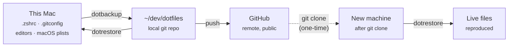

# System overview

> Purpose: The one-page answer to "what is this repo for, what runs on a
> schedule, and where does everything actually live." Ties together the
> per-topic docs rather than replacing them — each section links to the
> detailed file. Everything scheduled, in detail: [`maintenance.md`](./maintenance.md).
> The rules: [`policy/`](./policy/). The reasoning: [`design-decisions.md`](./design-decisions.md).

## 1. Why this repo exists

**To reproduce this entire computer from a GitHub clone.** Not just shell
config — the dev environment, editor settings, tool versions, and macOS app
preferences, so that replacement hardware can be brought back to a working
state without reconstructing anything from memory.

The success criterion is concrete: on a brand-new Mac, `git clone` followed
by `dotrestore` should produce a usable machine.

`dotrestore` is the same command in both places — recovering a broken config
on this Mac and bootstrapping a new one are the same operation. The dashed
hop is the only manual step unique to new hardware.

**Important asymmetry:** `dotbackup` flows one way, live → repo. An edit made
to the *repo* copy that isn't also made to the live file in `~` is silently
overwritten on the next backup. This has bitten this repo before — see
[LEARNINGS.md](../LEARNINGS.md#issue-edits-made-in-the-repo-silently-disappear-after-dotbackup).

## 2. Where everything lives

Paths changed on 2026-09-01; these are current.

| Thing | Path | Notes |
|---|---|---|
| This repo | `~/dev/dotfiles` | moved from `~/dotfiles` |
| Loose personal scripts | `~/dev/projects/scripts/` | moved from `~/scripts`, which no longer exists |
| `mac-maintenance.sh` | `~/dev/dotfiles/scripts/` | **repo only** — single copy, run directly from here |
| `weekly-disk-cleanup.sh` | `~/dev/projects/scripts/` | live copy; launchd runs this path. Repo holds a manual backup copy |
| LaunchAgent plist | `~/Library/LaunchAgents/com.pieterdejong.weeklycleanup.plist` | backed up to `macos/` and synced by `dotbackup` |
| Security audit plist | `~/Library/LaunchAgents/com.pieterdejong.securityaudit.plist` | repo is the source (`macos/`); installed by copying |
| Security gate | `~/dev/dotfiles/security/gate.sh` | **repo only** — `~/.gitconfig` points at it in place |
| Private companion repo | `~/dev/dotfiles/private/` | separate private repo, gitignored here |
| Audit reports | `~/dev/audit-reports/` | never inside a git repo |
| Secrets | `~/.zshrc.secret` | outside the repo, mode `0600`, never committed |

Most of the repo is **copy-based, not symlinked** — live files in `~` are
what the system reads; the repo holds copies. `mac-maintenance.sh` is the
one deliberate exception: it has no live copy and is executed straight out
of the repo, so there is nothing to keep in sync.

## 3. Maintenance model

| | `security-audit.sh` | `weekly-disk-cleanup.sh` | `mac-maintenance.sh` |
|---|---|---|---|
| **Trigger** | Automatic — launchd, Sundays 10:00 | Automatic — launchd, Sundays 09:00 | Manual — you run it |
| **Scope** | gate, every repo, GitHub settings, uncloned repos, loose credentials | npm/pip cache, Docker prune, Trash >7 days | Uptime, memory report, `~/Library/Caches` |
| **Risk posture** | Read-only; report outside git | Only reclaims what regenerates or was already discarded | Reporting + cache quarantine |

All three, plus the per-commit security gate: [`maintenance.md`](./maintenance.md).

### The goal for `mac-maintenance.sh`

**Eventually run it on a schedule** — daily or weekly, the same launchd
pattern the weekly cleanup already uses — so Mac housekeeping happens
without being remembered. The blocker is **idempotency**: a scheduled script
must be safe to re-run indefinitely without cumulative side effects.

Current status:

- **Uptime / memory reporting** — read-only, already idempotent.
- **Library caches cleanup** — as of 2026-09-01 this *moves* caches into a
  uniquely timestamped `~/.Trash/mac-maintenance-caches-<timestamp>/` folder
  instead of `rm -rf`. Repeated runs never collide, and
  `weekly-disk-cleanup.sh`'s 7-day Trash purge is what actually reclaims the
  space — so there's a real restore window. Effectively idempotent, but not
  yet verified across repeated runs.

Not yet scheduled. That's the next step once repeated runs are confirmed safe.

## 4. Run history

Every run of `mac-maintenance.sh` writes `~/maintenance-YYYYMMDD.log`. Three
runs exist so far, all manual — the gaps are eight months, then eight days,
which is exactly the problem scheduling is meant to solve.

| Run | Available memory | `~/Library/Caches` | Reclaimed |
|---|---|---|---|
| 2025-12-21 | 10.13 GB | — | — |
| 2026-08-24 | 10.25 GB | 262M → 258M | ~4 MB |
| 2026-09-01 | 9.97 GB | 4.4G → 124K | ~4.3 GB |

Reading these honestly:

- **The Dec 2025 run predates the cache step**, which was added 2026-08-24 —
  hence no figure.
- **The 2026-09-01 figure is not a typical weekly delta.** It was triggered
  while verifying the script consolidation, and it cleared caches that had
  accumulated across the preceding eight months. A scheduled weekly run would
  show numbers far closer to the 4 MB row.
- **All three runs predate the move-to-Trash change**, so their "After"
  figures reflect the old immediate `rm -rf` behaviour.
- **Memory readings are a snapshot, not a trend.** Three points taken at
  unrelated moments of unrelated workloads; the ~0.3 GB spread is noise, not
  signal. It becomes a real series only once runs are scheduled.

## 5. Visualization

A rendered view of the pipeline diagram and the run-history data:

**<https://claude.ai/code/artifact/7717cc86-7fd6-489d-98a6-2332fda381a1>**

Private to this account — the link will not resolve for anyone else unless
explicitly shared.

## 6. Related docs

| Doc | What it covers |
|---|---|
| [README](../README.md) | Quick start, commands, security posture, live TODO list |
| [`maintenance.md`](./maintenance.md) | Every scheduled job, the manual script, Full Disk Access limitation, monthly checklist |
| [`policy/`](./policy/) | Security & privacy, repo standards, AI instruction files, backups |
| [`design-decisions.md`](./design-decisions.md) | Why the gate, weekly audit and public/private split work as they do |
| [LEARNINGS.md](../LEARNINGS.md) | Reusable gotchas — including the one-way `dotbackup` hazard |
| [`reinstall-commands.md`](./reinstall-commands.md) | Commands to reconstruct the system |
