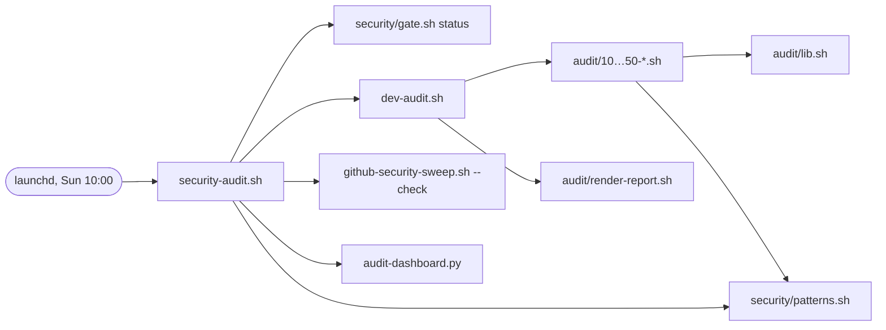

# `scripts/` — small tools that compose

Management and maintenance tooling for this Mac, `~/dev` and this repo. Not on `PATH` — see
[`bin/README.md`](../bin/README.md) for why, and for the commands that are.

## The objective

`scripts/` holds scripts **in whatever language suits the job**, each with **one specific
purpose**, built to be **combined** rather than grown. A new need is met by a new small script,
or by a composer that calls existing ones — not by another subcommand on a big one.

Every script, whatever it is written in, keeps the same contract:

| # | Rule | Why |
|---|---|---|
| 1 | **One purpose**, stated in one line at the top of the file | if the line needs "and", it is two scripts |
| 2 | **Header comment is the documentation**: purpose, usage lines, flags, exit codes, env overrides | `--help` prints it; nothing else has to be kept in sync |
| 3 | **`-h`/`--help`** prints the header and exits 0 | discoverable without reading source |
| 4 | **Exit codes**: `0` ok · `1` findings / failure · `2` bad usage | a composer branches on the code, not on parsing text |
| 5 | **Data on stdout, diagnostics on stderr**; `--quiet` for problems only | pipes carry results, not noise |
| 6 | **Machine-readable output is a file or stream the caller names** (`--out`, TSV/JSON) — and the script prints the path it wrote | callers never reconstruct another script's filenames |
| 7 | **Read-only by default.** Anything that changes state needs an explicit flag (`--apply`, `--execute`) and supports a dry run | safe to run, safe to compose, safe to schedule |
| 8 | **Locations resolve relative to the script** (`$SCRIPT_DIR`), and every external location is an env-var override | runs from anywhere; tests point it at a sandbox |
| 9 | **No personal values.** This repo is public: no emails, hosts, real paths. Private values come from `private/` or the environment | see [policy](../docs/policy/security-and-privacy.md) |
| 10 | **Each script has a test** (`test-<name>.*`) wired into [`../test.sh`](../test.sh), and a linter for its language | CI runs exactly `./test.sh` |

### Languages

Pick the language that fits the job, not the one the directory already uses:

| Language | Use for | Shebang | Lint in `test.sh` |
|---|---|---|---|
| bash (3.2-compatible) | gluing CLI tools, git, launchd jobs | `#!/usr/bin/env bash` | `shellcheck` |
| zsh | only when zsh-specific; prefer bash here | `#!/usr/bin/env zsh` | `zsh -n` |
| Python 3 (stdlib only) | parsing, JSON/TSV transforms, anything with data structures | `#!/usr/bin/env python3` | `ruff` (`PYTHON_FILES` in `test.sh`) |
| others (Swift, Go…) | only with a clear reason, e.g. a macOS API | — | add to `test.sh` in the same commit |

No script may require an install step beyond what [`tools/Brewfile`](../tools/Brewfile) provides.
A Python script uses the standard library only, so it needs no venv.

### Layout

```
scripts/
  <name>.<ext>          one executable per purpose
  <name>/               modules and helpers that belong to exactly one script
  lib/                  helpers shared by several scripts   (not yet needed)
  test-<name>.<ext>     the test for <name>
  test/                 integration tests that are not tied to one script
```

## What is here

### Tools

| Script | Lang | Purpose | Mode | Test |
|---|---|---|---|---|
| [`dev-audit.sh`](dev-audit.sh) (`dotaudit`) | bash | audit every git repo under `~/dev`: git hygiene, policy, privacy, disk | read-only | `test-dev-audit.sh` |
| [`audit/`](audit/) | bash | `dev-audit.sh`'s modules (`10-`…`50-*.sh`), shared `lib.sh`, and `render-report.sh` (TSV → markdown) | sourced / read-only | via `test-dev-audit.sh` |
| [`github-security-sweep.sh`](github-security-sweep.sh) | bash | GitHub-side protection on every owned repo | dry run · `--check` · `--apply` | `test-security-tools.sh` |
| [`containers-doctor.sh`](containers-doctor.sh) | bash | check that containers run the way [`docs/containers.md`](../docs/containers.md) says | read-only | `test-containers-doctor.sh` |
| [`security-audit.sh`](security-audit.sh) | bash | **composer**: the weekly audit — calls the gate, `dev-audit.sh`, `github-security-sweep.sh`, then adds its own checks | read-only | `test-security-tools.sh` |
| [`audit-dashboard.py`](audit-dashboard.py) | python | render one local HTML dashboard from the audit reports, findings TSVs and the cleanup log; `security-audit.sh` calls it last | writes only `audit-reports/dashboard.html` | `test-security-tools.sh` |
| [`sync-dotfiles.sh`](sync-dotfiles.sh) (`dotfiles`) | bash | copy configs between `~` and this repo (`backup`, `restore`, `status`, `extensions`, `push`) | mutating, `--dry-run` | partly, `test-security-tools.sh` (sanitizers) |
| [`mac-maintenance.sh`](mac-maintenance.sh) | bash | uptime and memory report; moves `~/Library/Caches/*` to Trash | mutating, no dry run | none |
| [`dothelp.sh`](dothelp.sh) (`dothelp`) | bash | print a hand-written cheat sheet of the `dot*` commands | read-only | none |

Scheduling and output locations: [`docs/maintenance.md`](../docs/maintenance.md).

### Tests

| Script | Covers | In `test.sh` |
|---|---|---|
| `test-dev-audit.sh` | `dev-audit.sh` + `audit/` against fixture repos | yes (`dotaudit`) |
| `test-security-gate.sh` | [`security/gate.sh`](../security/gate.sh) | yes (`gate`) |
| `test-security-tools.sh` | sweep, weekly audit, dashboard, gate module, Claude guard hook, sync sanitizers | yes (`tools`) |
| `test-containers-doctor.sh` | `containers-doctor.sh` in a stubbed sandbox | yes (`containers`) |
| `test-bin.sh` | [`bin/`](../bin/) | yes (`bin`) |
| `test-docs.py` | policy doc links and anchors, index coverage, workspace `CLAUDE.md` sync | yes (`docs`) |
| `test-dotfiles-setup.sh` (`dottest`) | checks that this machine's live configs are in place | **no** |
| `test/assertions.sh` | a restore into a clean Debian container ends up in the expected state | **no** (manual `docker run`) |

### How they compose



`dev-audit.sh` is the model to copy: small modules with one question each, a shared lib, checks
that write TSV, and a separate renderer that can re-render an old TSV without re-running the sweep.

## Audit against the objective — 2026-09-24

**Already in line:** `dev-audit.sh` + `audit/`, `github-security-sweep.sh`, `containers-doctor.sh`
and `security-audit.sh` follow rules 1–5, 7, 8 and 10: each has a usage header, `--help`,
`0/1/2` exit codes, a read-only default, `$SCRIPT_DIR` resolution, env overrides and a hermetic
test in `test.sh`. `security-audit.sh` is a real composer — it calls other scripts instead of
re-doing their work.

**Gaps, most important first:**

1. **One language only.** Every script is bash. Nothing breaks because of that, but the
   harness is bash-only too: `test.sh` has no lint step for any other language. The first
   Python script has to add `ruff` (or similar) to `test.sh` in the same commit.
2. **`sync-dotfiles.sh` does five jobs** (rule 1). At 371 lines it has no header, no `--help`
   (rules 2, 3), and paths are hardcoded to `$HOME/dev/dotfiles` (rule 8). Its `push`
   subcommand runs `git add -A`, commits and pushes this *public* repo, so a copy tool also
   publishes. The `dotbackup` alias points at `push`, not `backup`, which is surprising.
   Split it: backup / restore / status stay, `extensions` becomes its own script, and `push`
   goes away (commit and push by hand, through the gate).
3. **Composers depend on hidden filenames** (rule 6). `security-audit.sh` rebuilds its callees'
   output names (`findings-$STAMP.tsv`, `github-security-$STAMP.tsv`) instead of being told the
   path. If one side changes its naming, or a run crosses a boundary its stamp depends on, the
   audit silently reads nothing. Fix: callees print the path they wrote, or take a full `--out FILE`.
4. **`mac-maintenance.sh` reports and mutates in one script** (rules 1, 7). There's no `--help`,
   no dry run and no test, and it writes its log to the top of `$HOME`. `docs/maintenance.md`
   runs it with `zsh`, but its shebang is bash. Split it into a read-only report and a cache
   mover with `--execute`.
5. **`dothelp.sh` is a second copy of the docs** (rule 2). Its hand-written text has already
   drifted: it lists `dottest` next to `./test.sh`, which run different things. It should
   print each script's header instead (`sed -n` the same range `--help` uses).
6. **Two test entry points, and two tests outside CI** (rule 10). `test-dotfiles-setup.sh` checks
   live machine state, so it cannot run in CI. That makes it a doctor, not a test: rename it
   (e.g. `dotfiles-doctor.sh`). It has 40 shellcheck findings and messages that still say
   `~/dotfiles`. `test/assertions.sh` is a real test but runs only by hand.
7. **Linting stops at the scripts on the list.** `test.sh` shellchecks an explicit list, so
   `mac-maintenance.sh`, `dothelp.sh`, `test-dotfiles-setup.sh`, `test-dev-audit.sh` and
   `test/assertions.sh` are never linted. Globbing `scripts/**/*.sh` would stop new scripts
   falling through the same gap.
8. **Tests and tools share one flat directory.** Six of the thirteen top-level scripts are tests.
   This is manageable today; move them to `tests/` once there are more (that also means
   updating the paths in `test.sh`).
9. **Small duplication.** The GitHub owner is hardcoded in both `security-audit.sh` and
   `github-security-sweep.sh` instead of being passed down. Untracked `*.bak` copies of
   `dothelp.sh` and `sync-dotfiles.sh` sit next to the originals; they are gitignored, so they
   only clutter the local tree.

## Adding a script

1. One purpose, one file: `scripts/<name>.<ext>`, executable, with a shebang.
2. Header: purpose line, usage lines, flags, exit codes, env overrides. Make `--help` print it.
3. Read-only unless given an explicit flag; mutating scripts get a dry run.
4. Add `test-<name>.<ext>` and a suite in [`../test.sh`](../test.sh); lint it there too.
5. Add a row to the table above, and to [`docs/maintenance.md`](../docs/maintenance.md) if it
   is scheduled.
